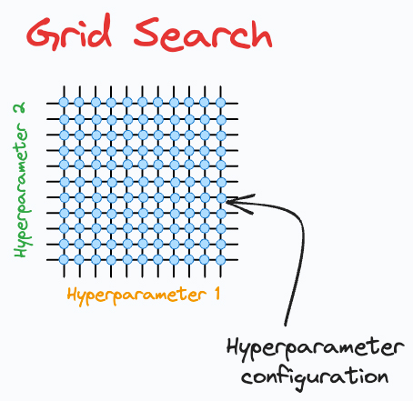

## Overview

In this project, I demonstrated how to create a binary classification model using a synthetic dataset generated by `sklearn`. I built the model using TensorFlow and Keras, and I utilized Grid Search for hyperparameter tuning.
 
With this project, I announce my entry into the fascinating world of Deep Learning. 🤩🎈

## Project Description

In this project, I aimed to develop a binary classification model to predict class labels based on a dataset with 20 features. The dataset consisted of 1000 samples, where a subset of features was informative and redundant.

To enhance the model's performance, I implemented Grid Search with cross-validation to identify the optimal hyperparameters for the number of hidden units and the optimizer type.

## Dataset

For this project, I used the `make_classification` function from `sklearn.datasets` to generate a synthetic binary classification dataset..

## Grid Search for Hyperparameter Tuning

Grid Search is a powerful technique that I used to find the best combination of hyperparameters for the machine learning model. It exhaustively tested all possible combinations of the specified hyperparameters to identify which set yielded the best model performance.

In this project, I utilized `GridSearchCV` from `sklearn.model_selection` in combination with a `KerasClassifier` wrapper. The parameters I explored included:

- `hidden_units`: The number of units in the hidden layers (values tested: 16, 32, 64, 128).
- `optimizer`: The optimization algorithm used during training (values tested: 'adam', 'rmsprop').

## Dependencies

- TensorFlow
- Keras
- Scikit-learn
- Scikeras

## Conclusion

This project provides a comprehensive understanding of building and tuning a binary classification model using synthetic data. The utilization of Grid Search allows for systematic exploration of hyperparameters, leading to improved model performance. TensorFlow and Keras offer powerful tools for building deep learning models, while Scikit-learn’s Grid Search capabilities streamline the optimization process.

Feel free to explore the code, modify parameters, and experiment with different configurations to observe how they affect the model's performance!